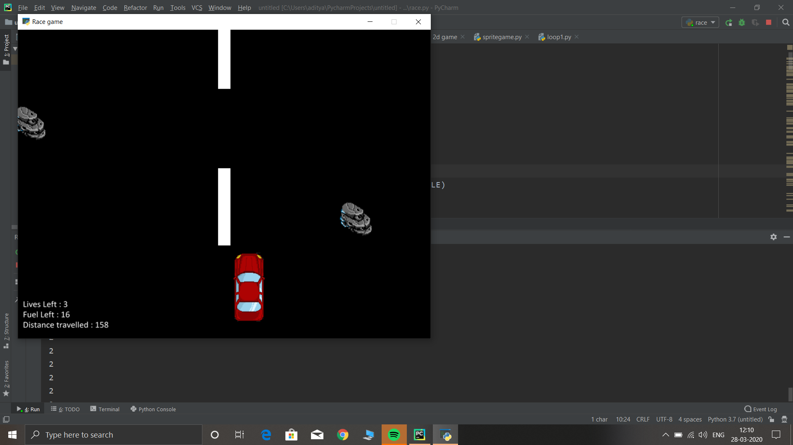
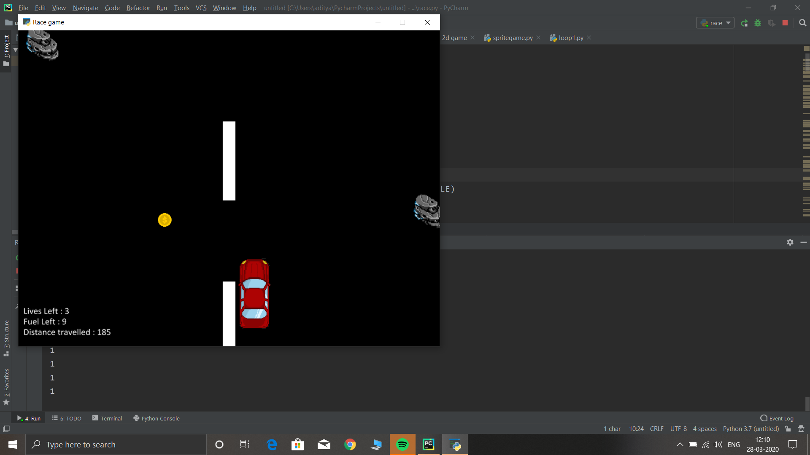

# The Red Driver Game
A simple python game where you have to control a car ,avoid rocks , collect coins and travel your way

## Starting up :

 1. Should have `python` installed in the system.
 2. Install `pip install poetry`
 3. Setup the project `poetry install`
 4. Run the game `poetry run python ./race/race.py`

# Game play :
 
 MOVE RIGHT - RIGHT ARROW KEY
 MOVE LEFT  - LEFT ARROW KEY

## Screenshots 

## Credits
[Original repository](https://github.com/git-aditya-star/python-game-The-red-driver) by [Aditya Chavan](https://github.com/git-aditya-star)